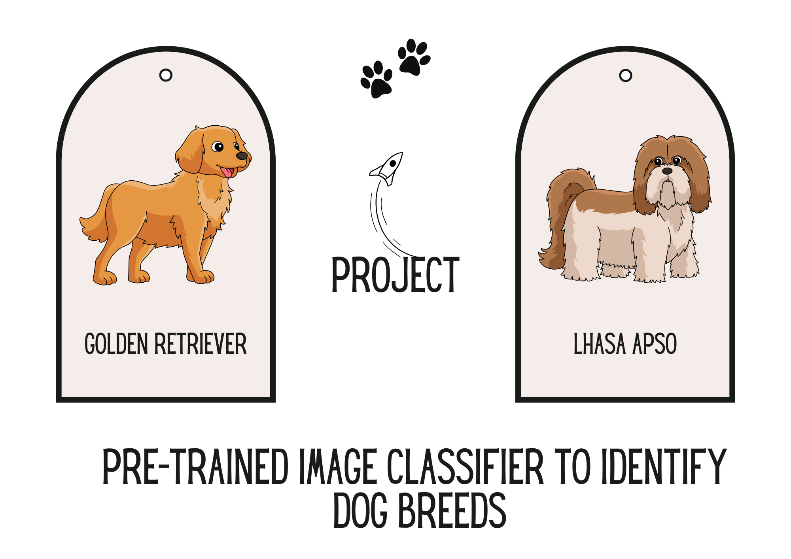
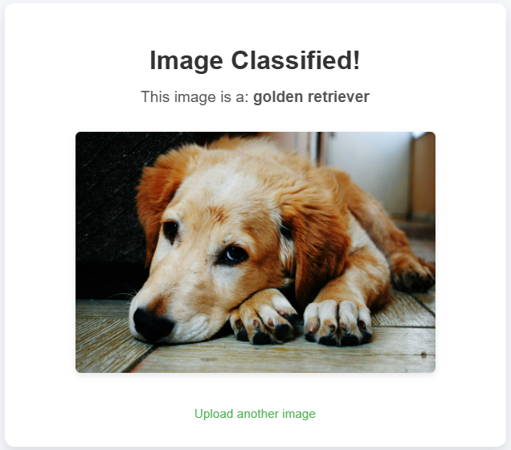

# Dog Breed Classifier

## Overview
The **Dog Breed Classifier** is a machine learning-powered application built to identify dog breeds based on images. The project uses a pre-trained deep learning model, ResNet, for accurate breed classification. This project serves as a capstone for the **AI Programming with Python Nanodegree** at Udacity.

---

## Project Goal
The goal of this project was to enhance Python programming skills while implementing an image classifier to identify dog breeds. The classifier used a pre-trained Convolutional Neural Network (CNN) model that was trained on over 1.2 million images from **ImageNet**. The focus was on utilizing Python to work with these models rather than building the classifier itself from scratch.

---

## Features
- Upload a dog image to classify its breed.
- User-friendly interface for easy interaction.
- Uses a pre-trained **ResNet** model for accurate predictions.
- Identifies whether an image contains a dog or not, using classification algorithms.

---

## Technologies Used
- **Python**: For backend development.
- **Flask**: Web framework used to create the web application.
- **PyTorch**: Deep learning library used for implementing the ResNet model.
- **ResNet**: Pre-trained neural network used for image classification.

---

## Project Structure
The directory structure of the project is as follows:

- **`app.py`**: The main Flask application file that runs the web app.
- **`static/uploads/`**: Directory for storing uploaded dog images temporarily.
- **`templates/`**: Contains HTML templates for rendering the web pages.
- **`data/`**: Contains auxiliary files like `classifier.py`, which handles the model and image processing.

---

## How It Works
1. Users upload an image of a dog.
2. The application processes the image using the pre-trained ResNet model.
3. The breed of the dog is predicted and displayed alongside the uploaded image.

---

## Preview
Here’s a preview of the application interface:

---

## Getting Started

### Prerequisites
Make sure you have the following installed:
- **Python 3.x**
- **Flask**
- **PyTorch**
- **TorchVision**

## Future Enhancements
- Support for multiple models (e.g., VGG, AlexNet) for comparison.
- Improve classification accuracy for mixed-breed dogs.
- Implement a mobile version of the application for greater accessibility.

## Website
[Dog Breed Classifier Website](https://astrotech-666.github.io/dog-breed-classifier)

## Author
Developed by **Farzana**  
GitHub: [AstroTech-666](https://github.com/AstroTech-666)

## About
This is the first capstone project I worked on as part of the 'AI Programming with Python Nanodegree' at Udacity. The primary objective was to implement a deep learning model for image classification using PyTorch.

## Questions Answered
The project involved answering the following key questions regarding model performance:
- Which model architecture performs best on classifying images as dogs or not dogs?
- How well does the best-performing model identify the breed of the dog?
- What is the runtime for each model architecture when solving the classification task?

Results from experiments showed that ResNet was the best-performing model, providing a good balance of accuracy and runtime.

## Topics
- Python
- Neural Networks
- PyTorch
- AlexNet
- VGG16
- ResNet18
- Image Classification

## Resources
- [Udacity AI Programming with Python Nanodegree](https://www.udacity.com/course/ai-programming-python-nanodegree--nd089)
- [PyTorch Documentation](https://pytorch.org/docs/stable/)
- [Flask Documentation](https://flask.palletsprojects.com/)
